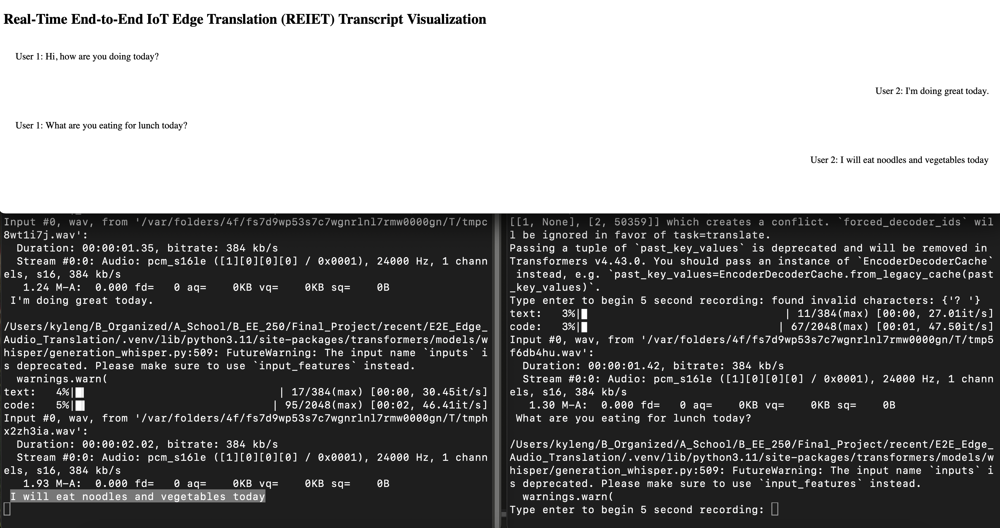
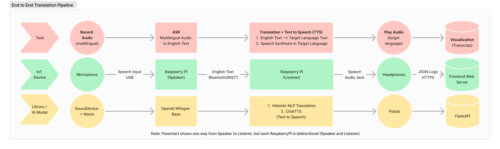

# Real-Time End-to-End  IoT Edge Translation (REIET)
[](https://youtu.be/b30KwzEInOY)
___
## Table of Contents
1. [Introduction](#introduction)
   - [What makes `REIET` special?](#what-makes-reiet-special)
   - [Motivation](#motivation)
2. [Pipeline and Tech Stack](#pipeline-and-tech-stack)
   - [Tech Stack](#tech-stack)
   - [Pipeline](#pipeline)
3. [Installation Instructions](#installation-instructions)
   - [Prerequisites](#prerequisites)
   - [Installing](#installing)
     - [Linux Dependencies](#linux-dependencies)
     - [Mac/Windows Dependencies](#macwindows-dependencies)
4. [Pipeline Overview](#pipeline-overview)
   - [Real-Time Translation](#real-time-translation)
   - [Transcript Visualization](#transcript-visualization)
5. [Running the Pipeline](#running-the-pipeline)
   - [Bluetooth Mode](#bluetooth-mode)
     - [Running the Server](#running-the-server)
     - [Running the Client](#running-the-client)
   - [MQTT Mode](#mqtt-mode)
   - [Running the Transcript](#running-the-transcript)
6. [Unit Testing](#unit-testing)
   - [Audio Handler](#audio-handler)
   - [ASR Handler](#asr-handler)
   - [Translation Handler](#translation-handler)
   - [TTS Handler](#tts-handler)
   - [Self Loop](#self-loop-recording--asr--translation--tts)
7. [How to Contribute](#how-to-contribute)

___
## Introduction
Real-Time End-to-End  IoT Edge Translation (`REIET`) is an IoT Edge translation pipeline designed to allow speakers of different languages communicate seamlessly in real time.

### What makes `REIET` special?
1. Deploying on IoT Edge
	1. Rather than relying on Cloud APIs, we use small Language Models to run the entire Automatic Speech Recognition (ASR), Translation, and Text to Speech (TTS) pipeline **on device**
	2. Rather than choosing general purpose large models, we use <small>smol</small> domain specific models (i.e. Whisper-Base/Seq2Seq Translation model) to meet RAM and latency requirements
2. Wifi No More
	1. Most conversations happen spontaneously and face to face where a strong wifi connection may not be possible
	2. In combination with on device ML inference, we utilize bluetooth as our data link to provide a **Wifi-less mode** so `REIET` can translate where you communicate
3. Distributed Topology (Hardware Agnostic)
	1. `REIET` was originally designed to run on Linux devices but requires knowing MAC addresses before hand for bluetooth data link
	2. To allow `REIET` to support an arbitrary number of nodes across different localities (places), we also support an experimental [MQTT (OSI Application Layer) Pub/Sub Architecture](https://aws.amazon.com/what-is/mqtt/) mode

### Motivation
With the innovation in Natural Language Processing (NLP), we seek to bridge the multilingual communication gap with a simple mission:

**Help people have natural, meaningful conversations in their [Native Language](https://www.brainyquote.com/quotes/nelson_mandela_121685)**
___
## Pipeline and Tech Stack
### Tech Stack
1. Machine Learning Stack 
	1. Pytorch (Inference)
	2. HuggingFace (Inference)
	3. ChatTTS (Text to Speech)
	4. OpenAI Whisper-Base
2. Audio Processing Stack
	1. Wavio
	2. Pydub
3. Communication Protocol Stack
	1. Bluedot
	2. Paho-MQTT
	3. Wavio + Sounddevice

### Pipeline

For full writeup checkout: [tinyurl.com/REIET-writeup](https://tinyurl.com/REIET-writeup)

<small>The flowchart above shows the pipeline from Listener RPi to Speaker RPi. Since both RPi's are both Listeners and Speakers, the pipeline is replicated symmetrically and bidirectionally</small>

| Step | Task                               | IoT Device              | Protocol       | Processing Technique                                         |
| ---- | ---------------------------------- | ----------------------- | -------------- | ------------------------------------------------------------ |
| 1    | Record Audio                       | Microphone              | USB            | SoundDevice + Wavio                                          |
| 2    | Automatic Speech Recognition (ASR) | Raspberry Pi (Speaker)  | Bluetooth/MQTT | OpenAI Whisper, Deep Learning Transformer Architecture model |
| 3    | Translation + Text to Speech (TTS) | Raspberry Pi (Listener) | ~              | Helsinki-NLP for translation and ChatTTS for text to speech  |
| 4    | Play Audio                         | Headphones              | Audio Jack     | Pydub audio playback library                                 |
| 5    | Visualize Transcription            | Raspberry Pi or Laptop  | HTTPS          | FlaskAPI from JSON log file to a Web Server                  |
___
## Installation Instructions

### Prerequisites
1. 64-bit Operating System
	1. The RPi default image has a 32-bit OS, a 64-bit OS can be found under [Raspberry Pi OS with desktop and recommended software](https://www.raspberrypi.com/software/operating-systems/#raspberry-pi-os-64-bit)
2. `Python 3.10` (Pytorch and ChatTTS)
	1. Note: `Python3.12` comes with the RPi image linked above

### Installing
1. Clone Repository
```zsh 
git clone git@github.com:Ky-Ng/REIET.git
cd REIET
```
#### Linux Dependencies
- Install script 
```zsh
source install.sh
```

#### Mac/Windows Dependencies
```
pip3 install -r requirements-local.txt
```
___
## Pipeline Overview
### Real-Time Translation
There are two main ways to run the pipeline:
1. `Bluetooth Mode`: Server-Client mode
	1. Run `Bluetooth` mode if your IoT devices are in close proximity or you wish to support wifi-less conversational translation
2. `MQTT Mode`: Distributed mode
	1. Run `MQTT` mode if you would like to support IoT devices which do not support bluetooth or you wish to support translation from arbitrary distances 
		1. Note: MQTT only needs wifi and need not be in close physical range of other nodes
		2. MQTT may also be helpful if pairing between hardware devices is difficult (i.e. Mac and Windows)

### Transcript Visualization
Additionally, we also support a visualization of the English transcript of the conversation through a simple Flask API `web app`.
___
## Running the Pipeline
### Bluetooth Mode
#### Running the Server
- Run the server device by specifying the `-c` flag
```
python3 e2e/e2e_client_server.py -s -l <LANGUAGE_ISO_639_CODE>
```
#### Running the Client
- Run the client device by specifying the `-c` flag
- The `MAC_ADDRESS` is the MAC address of your Server node
```
python3 e2e/e2e_client_server.py -c <MAC_ADDRESS> -l <LANGUAGE_ISO_639_CODE>
```

### MQTT Mode
- Since `MQTT Mode` is distributed, there are no `servers` and `clients`
- Instead, nodes publish and subscribe to a `topic_name` which is similar to a "chat room" name
```
python3 e2e/e2e_client_server_mqtt.py -t <TOPIC_NAME> -l <LANGUAGE_ISO_639_CODE>
```

### Running the Transcript
- View the transcript on either the Server or Client through a flask server
	- Note: you will need to refresh the web browser when the new audio message is received
```
python3 gui/flask-server.py
```
- Note: the `-l` language options are `en` for English and `zh` for Chinese
___
## Unit Testing
- If you run into errors above, running the following unit tests below will help to verify that each part of the pipeline is working correctly:
### Usages
1. Each testing script will also help guarantee your objects/imports/dependencies are nominal with the message: `Initializing Class...success!`
2. Each file that takes arguments has a `-h` flag for user friendliness as well
3. Note: these examples assume we are running from the root of the repository

#### Audio Handler
```bash
# Outputs Saved to "./testing/testing_outputs/test_audio_handler.wav" by default
python testing/testAudioHandler.py   
```

#### ASR Handler
```bash
# python testing/testASRHandler.py -a {AUDIO_FILE}
# ex:
python testing/testASRHandler.py -a testing/testing_outputs/test_audio_handler.wav
```

#### Translation Handler
```bash
# python testing/testTranslationHandler.py -t {TEXT_TO_TRANSLATE} -l {ISO 639 Language Code}
# Chinese ex:
python testing/testTranslationHandler.py -t "hi there, what's your name" -l zh

# output:
	# Output Translation in zh: 嗨,你叫什么来着?
```

#### TTS Handler
```bash
# python testing/testTTSHandler.py -t {TEXT_TO_SYNTHESIZE} {-p, flag for playback}      

# ex: to synthesize and play the audio
python testing/testTTSHandler.py -t "what is the meaning of life" -p       

# ex: to synthesize and no audio playback
python testing/testTTSHandler.py -t "what is the meaning of life"     
```

#### Self Loop (Recording —> ASR —> Translation —> TTS)
- Note: the input language is not specified because we support any input language whisper can do ASR translation on
```bash
# python e2e/test_self_loop.py -l {OUTPUT_TTS_LANGUAGE}

# ex:
python e2e/test_self_loop.py -l zh
```
___
## How to Contribute
If you're interested in contributing to this repository, feel free to make a [Pull Request](https://github.com/Ky-Ng/REIET/pulls) or contact Jonathan Ong (ongjd \[at] usc \[dot] edu) and Kyle Ng (kgng \[at] usc \[dot] edu)